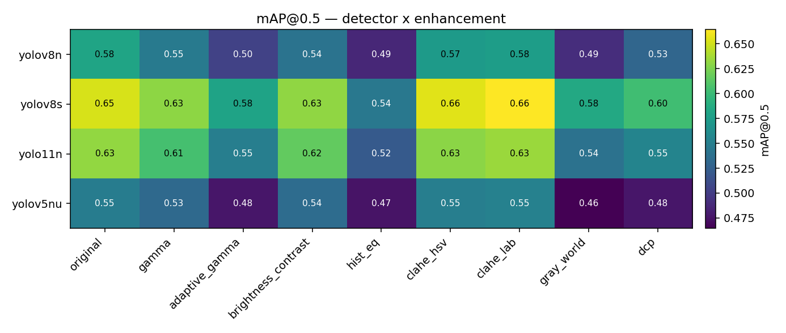

# Model × Enhancement Comparison

*Auto-generated. Device: `mps` · 15 images/class · seed 42.*

Every detector is evaluated against every enhancement on the **same** stratified test subset, with the **same** pooled COCO-style evaluator. The `original` column is each model's no-enhancement baseline; `Δ` is the best enhancement minus that baseline.

## mAP@0.5 matrix

| Detector | original | gamma | adaptive_gamma | brightness_contrast | hist_eq | clahe_hsv | clahe_lab | gray_world | dcp |
| --- | --- | --- | --- | --- | --- | --- | --- | --- | --- |
| yolov8n | **0.581** | 0.547 | 0.504 | 0.540 | 0.487 | 0.574 | 0.575 | 0.491 | 0.530 |
| yolov8s | 0.652 | 0.630 | 0.581 | 0.631 | 0.545 | 0.655 | **0.664** | 0.585 | 0.603 |
| yolo11n | 0.632 | 0.605 | 0.550 | 0.617 | 0.521 | 0.630 | **0.634** | 0.540 | 0.555 |
| yolov5nu | 0.548 | 0.533 | 0.477 | 0.535 | 0.475 | 0.550 | **0.552** | 0.465 | 0.476 |

## Does enhancement help each model?

| Detector | original | best enhancement | best mAP@0.5 | Δ vs original |
| --- | --- | --- | --- | --- |
| yolov8n | 0.581 | original | 0.581 | +0.000 |
| yolov8s | 0.652 | clahe_lab | 0.664 | +0.012 |
| yolo11n | 0.632 | clahe_lab | 0.634 | +0.002 |
| yolov5nu | 0.548 | clahe_lab | 0.552 | +0.004 |

## Which enhancement is best on average (across all models)?

| Enhancement | mean mAP@0.5 | Δ vs original |
| --- | --- | --- |
| clahe_lab | 0.606 | +0.003 |
| original | 0.603 | +0.000 |
| clahe_hsv | 0.602 | -0.001 |
| brightness_contrast | 0.581 | -0.023 |
| gamma | 0.579 | -0.025 |
| dcp | 0.541 | -0.062 |
| adaptive_gamma | 0.528 | -0.076 |
| gray_world | 0.520 | -0.083 |
| hist_eq | 0.507 | -0.096 |

> **How to read this.** If the best-enhancement column barely beats `original` (small positive Δ, often within the bootstrap CI), the honest conclusion is that classical enhancement on a *frozen* COCO detector is roughly neutral — adapting the detector (fine-tuning) is the real lever. See `results/report.md` for the fine-tuning arm.
