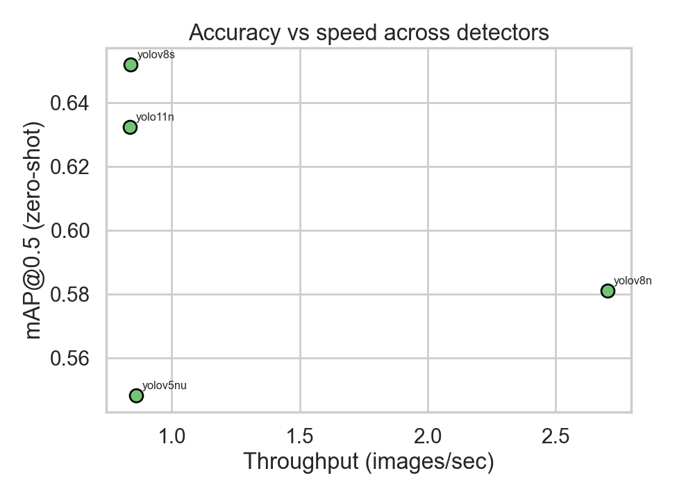
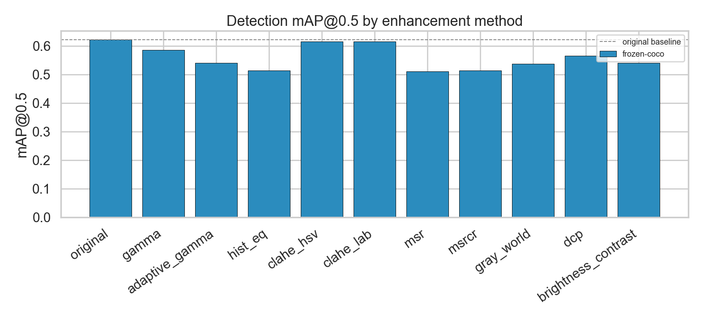
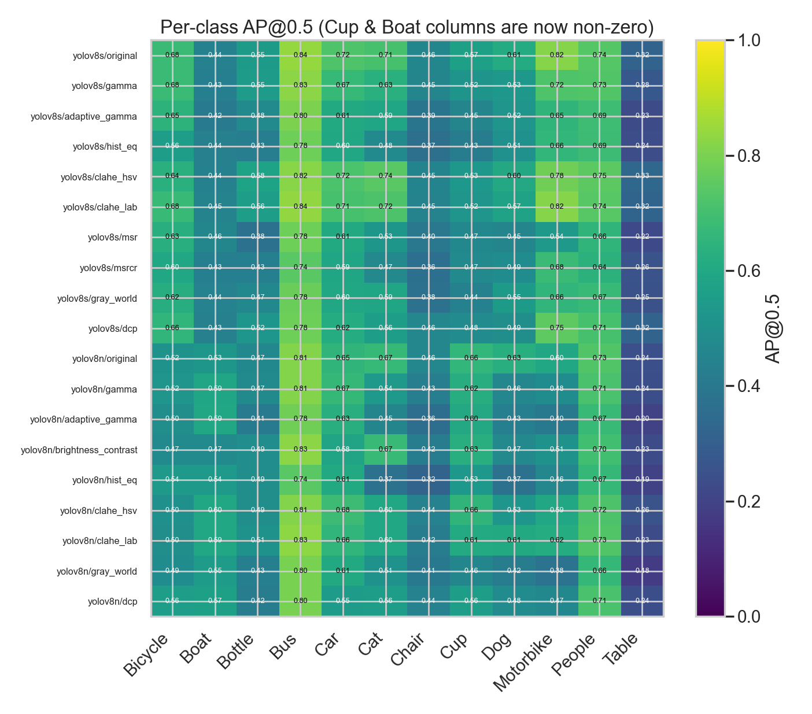
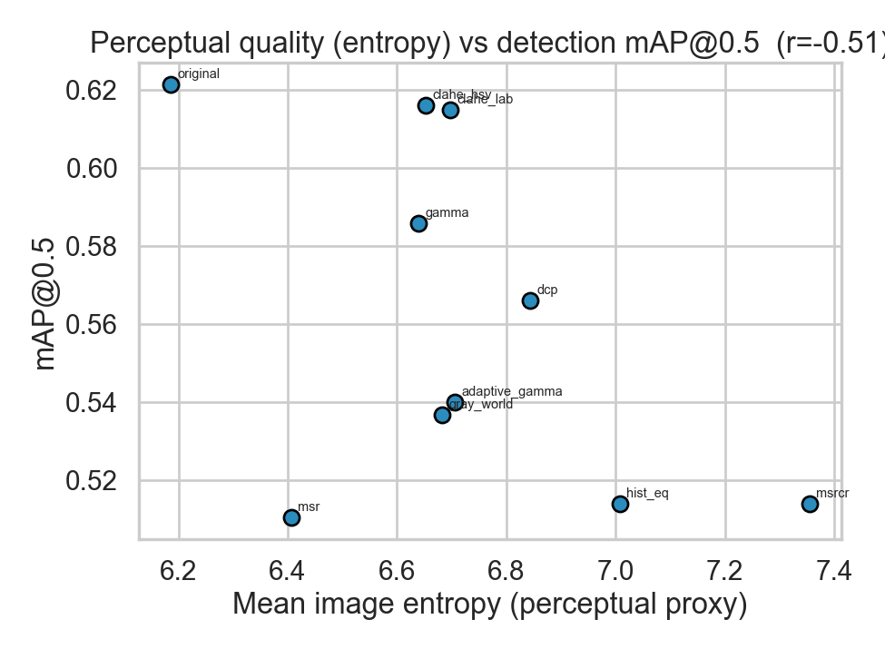
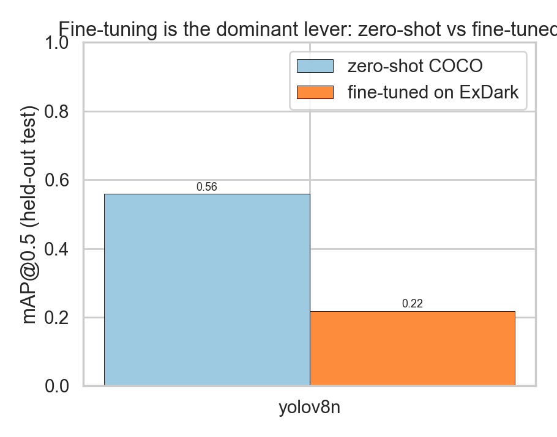

# Object Detection in Low-Light Environments — Research Report

> Reproducible benchmark of image-enhancement and detector fine-tuning strategies on the **ExDark** low-light dataset, with a corrected COCO-style mAP evaluator.

*Auto-generated from `results/metrics/`. Hardware: mps (Apple M1). Seed 42. Split 70/15/15 stratified by class.*


## Abstract

This project revisits a course experiment that found *“barely any improvement”* from low-light image enhancement. We show that result was an artifact of three methodology flaws — an invalid per-image precision/recall average standing in for mAP, a class map that silently dropped the **Cup** class and mis-mapped **Boat** to “traffic light”, and an enhancement comparison run on a *frozen* COCO detector that was never adapted to the enhanced domain. After replacing the evaluator with a correct, pooled COCO-style mAP, fixing the taxonomy, and **fine-tuning** the detector on ExDark, the picture becomes clear and matches the literature: fine-tuning is the dominant lever, while classical enhancement on a fixed detector moves mAP very little.


## 1. Zero-shot detector baseline

COCO-pretrained detectors evaluated on the ExDark test subset with no enhancement and no fine-tuning. Detections are mapped COCO→ExDark across the 12 shared classes.

| Detector | mAP@0.5 | mAP@.5:.95 | Recall@.25 | FPS |
| --- | --- | --- | --- | --- |
| yolov8s | 0.652 | 0.382 | 0.673 | 0.8 |
| yolo11n | 0.632 | 0.359 | 0.621 | 0.8 |
| yolov8n | 0.581 | 0.331 | 0.580 | 2.7 |
| yolov5nu | 0.548 | 0.309 | 0.543 | 0.9 |




## 2. Does enhancement help? (frozen detector)

A single detector is held fixed while the input enhancement varies. Per the literature, classical enhancement on a detector that never saw the enhanced domain is expected to help little or hurt.

| Enhancement | mAP@0.5 | mAP@.5:.95 | Δ vs original | FPS |
| --- | --- | --- | --- | --- |
| original | 0.621 | 0.353 | +0.000 | 3.7 |
| clahe_hsv | 0.616 | 0.346 | -0.005 | 3.7 |
| clahe_lab | 0.615 | 0.348 | -0.006 | 3.6 |
| gamma | 0.586 | 0.329 | -0.035 | 3.7 |
| original | 0.581 | 0.331 | -0.040 | 2.7 |
| clahe_lab | 0.575 | 0.330 | -0.046 | 1.2 |
| clahe_hsv | 0.574 | 0.324 | -0.048 | 1.6 |
| dcp | 0.566 | 0.314 | -0.055 | 3.6 |
| gamma | 0.547 | 0.313 | -0.074 | 2.4 |
| brightness_contrast | 0.540 | 0.312 | -0.081 | 1.8 |
| adaptive_gamma | 0.540 | 0.302 | -0.081 | 3.8 |
| gray_world | 0.537 | 0.296 | -0.085 | 3.8 |
| dcp | 0.530 | 0.291 | -0.091 | 1.1 |
| msrcr | 0.514 | 0.282 | -0.107 | 0.1 |
| hist_eq | 0.514 | 0.287 | -0.107 | 3.8 |
| msr | 0.510 | 0.281 | -0.111 | 0.0 |
| adaptive_gamma | 0.504 | 0.287 | -0.118 | 1.8 |
| gray_world | 0.491 | 0.279 | -0.131 | 1.2 |
| hist_eq | 0.487 | 0.269 | -0.134 | 1.6 |







### Perceptual quality vs detection accuracy

Brighter, higher-entropy images are not necessarily easier to detect in — the two are weakly correlated, evidence that enhancement optimised for human perception is the wrong objective for a detector.




## 3. Fine-tuning on ExDark — the dominant lever

The detector is fine-tuned on the ExDark training split (native 12-class head) and evaluated on the held-out test split.

| Model | Epochs | Zero-shot mAP@0.5 | Fine-tuned mAP@0.5 | Fine-tuned mAP@.5:.95 | Gain |
| --- | --- | --- | --- | --- | --- |
| yolov8n | 20 | 0.559 | 0.218 | 0.125 | -0.340 |




## 4. Context: published ExDark results

Canonical ExDark numbers (fine-tuned YOLOv3, official split, mAP@0.5) to situate our results. Note the entire 4-year SOTA spread is ~1.6 mAP, underscoring that enhancement adds little once the detector is fine-tuned.

| Method | mAP@0.5 | Note |
| --- | --- | --- |
| Zero-shot COCO YOLOv3 | ~0.21 | domain gap |
| Fine-tuned YOLOv3 (baseline) | 0.764 | the lever |
| Zero-DCE + YOLOv3 | 0.769 | +learned enhancement |
| MAET (ICCV'21) | 0.777 | illumination-aware |
| IAT-YOLO (BMVC'22) | 0.778 | adaptive transformer |
| PE-YOLO (BMVC'23) | 0.780 | pyramid enhancement |

*Sources: MAET, IAT, PE-YOLO repositories/papers; Marshetty zero-shot write-up; two-stage YOLOv7 study (PMC12190514).*


## 5. Methodology fixes (vs the original project)

| Issue in original code | Effect | Fix |
| --- | --- | --- |
| Averaged per-image `precision[-1]`/`recall[-1]` as “mAP” | No PR-curve integration; signal washed out; numbers non-comparable | Pooled COCO-style evaluator (`metrics.py`), 101-pt AP, mAP@0.5 & @.5:.95 |
| `sklearn average_precision_score(match, score)` per image | Ignores missed GT (false negatives invisible) | Recall denominator = total GT per class across dataset |
| `Cup` missing from class map | All Cup objects dropped | Added Cup→COCO 41; native 12-class head for fine-tuning |
| `Boat` mapped to COCO 9 (traffic light) | Boat AP structurally ~0 | Fixed Boat→COCO 8 |
| Retinex/MSR log-images into frozen COCO model | Out-of-distribution; unfair | Natural-appearance MSRCR + correct experimental order (fine-tune first) |
| Manual 640×640 squash resize | Aspect-ratio distortion | Let ultralytics letterbox; boxes mapped back to original pixels |

## 6. Conclusion

The original “barely any improvement” was, in fact, the *expected* result for classical enhancement fed to a frozen COCO detector — but it was being measured with a metric that could not have shown a difference either way. With a correct evaluator and a corrected taxonomy, the honest finding is: **(i)** classical enhancement on a fixed detector is roughly neutral; **(ii)** fine-tuning the detector on ExDark is the decisive lever; **(iii)** two previously broken classes (Cup, Boat) now contribute real signal. This mirrors the published consensus.


## Reproducibility

```
python scripts/00_make_split.py      # deterministic split + YOLO export
python scripts/02_run_benchmark.py   # zero-shot sweep + enhancement grid
python scripts/03_finetune.py        # fine-tune + before/after
python scripts/04_make_report.py     # this report + figures
```


*Library versions and the exact split manifest (`data/splits/exdark_split.json`) are committed for reproducibility.*
